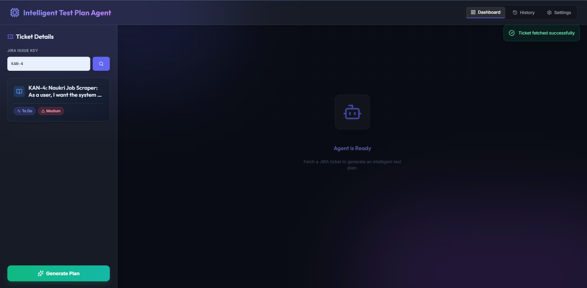
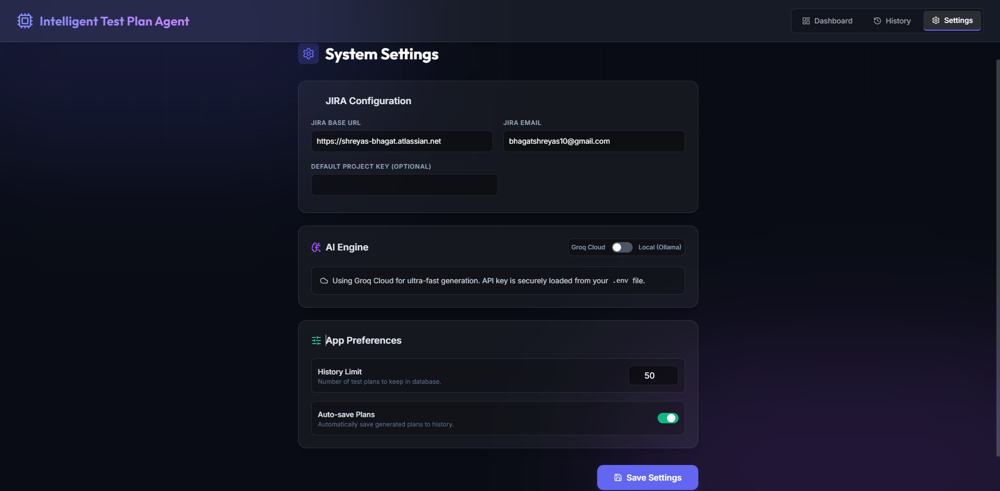
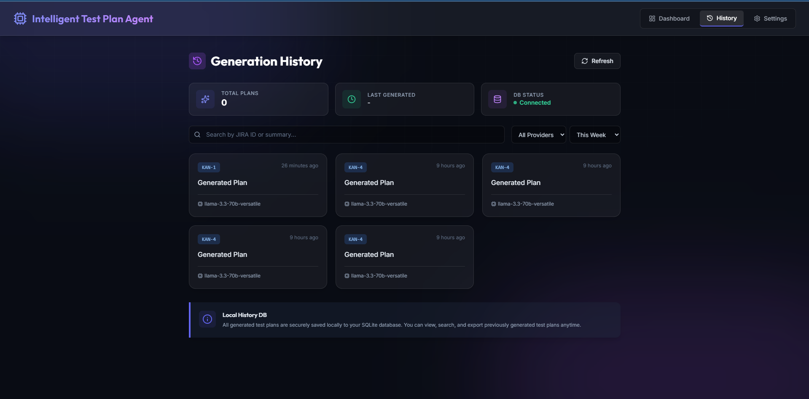

# 🎯 Intelligent Test Plan Agent


Welcome to the **Intelligent Test Plan Agent** — a premium, automated QA assistant
that dynamically generates comprehensive, enterprise-grade test plans based directly
on your JIRA tickets and your organisation's own PDF template.

Built with a lightning-fast **FastAPI** backend, an aesthetic **Glassmorphism UI**,
and powerful **Large Language Models**, this tool eliminates hours of manual QA
documentation overhead — in seconds.



---

## 🌟 Key Features

- **JIRA Integration** — Instantly pull JIRA issues (Epics, Stories, Bugs) via the Atlassian REST API v3
- **Template-driven Generation** — Reads your corporate QA standards directly from `testplan.pdf` to ensure the AI follows your exact organisational structure
- **AI-Powered Test Plans** — Leverages **Groq Cloud (Llama 3)** or **Local Ollama** to write deep, analytical, highly structured test cases, boundary tests, and edge case analyses
- **Real-time Streaming** — Watch your test plan generate live in the browser using Server-Sent Events (SSE)
- **Premium UI/UX** — Modern, responsive interface with Tailwind CSS, Lucide Icons, frosted-glass aesthetics, and dynamic micro-animations
- **History Dashboard** — Automatically saves all generations to a local SQLite database for instant reload of past plans
- **Multi-format Export** — Export seamlessly to **PDF**, **DOCX**, or copy raw **Markdown** to clipboard

---

## 🏗️ Architecture

| Layer | Technology |
|---|---|
| Backend | Python 3.11+, FastAPI, Uvicorn |
| Frontend | Vanilla JS (ES6+), HTML5, Tailwind CSS (CDN), Marked.js |
| AI Engine | Groq API (Cloud) / Ollama (Local) |
| Database | SQLite (`testplan_agent.sqlite`) via aiosqlite |
| Export | WeasyPrint (PDF), python-docx (DOCX) |
| JIRA | Atlassian REST API v3 |

---

## 📁 Project Structure

```
intelligent-test-plan-agent/
├── main.py                        ← FastAPI app entry point
├── requirements.txt               ← All Python dependencies
├── .env.example                   ← Template for secrets
├── .env                           ← Your local secrets (never commit)
├── .gitignore
├── testplan.pdf                   ← ⬅ Place YOUR template here
├── testplan_agent.sqlite          ← Auto-created on first run
│
├── api/
│   ├── routes/
│   │   ├── jira.py                ← JIRA connection + ticket fetch
│   │   ├── llm.py                 ← LLM generation + streaming (SSE)
│   │   ├── settings.py            ← Read/write app config
│   │   ├── export.py              ← PDF and DOCX export
│   │   └── history.py             ← Generation history CRUD
│   └── middleware.py              ← CORS, logging, error handling
│
├── core/
│   ├── config.py                  ← Config loader and validator
│   ├── jira_client.py             ← Async JIRA REST API client
│   ├── template_parser.py         ← pdfplumber reads testplan.pdf
│   ├── prompt_builder.py          ← Builds LLM prompt from JIRA + template
│   └── llm/
│       ├── base.py                ← Abstract LLM base class
│       ├── groq_provider.py       ← Groq streaming implementation
│       └── ollama_provider.py     ← Ollama streaming implementation
│
├── static/
│   ├── index.html                 ← Main SPA (entire UI)
│   ├── css/custom.css
│   └── js/
│       ├── app.js                 ← Main controller
│       ├── api.js                 ← All fetch calls to FastAPI
│       ├── streaming.js           ← ReadableStream SSE handler
│       ├── settings.js            ← Settings page logic
│       └── export.js              ← Export button handlers
│
├── assets/                        ← Screenshots for README
└── logs/
    └── app.log                    ← Auto-created by loguru
```

---
---
## 🖥️ Screenshots

### Dashboard


### Settings


### History


---

## 📄 Test Plan Template

> **This is a required step before generating any test plan.**

The application reads your organisation's QA structure from a file called
`testplan.pdf` located in the **project root directory**.

The AI will follow the exact sections defined in your template — including
headings, structure, and any organisational standards.

**Setup:**
1. Place your `testplan.pdf` file in the project root (same folder as `main.py`)
2. A default template is included in the repository — replace it with your own
3. The template sections are auto-detected on startup and shown in Settings

**Supported template sections (auto-detected):**
- Introduction / Overview
- Scope (In Scope / Out of Scope)
- Test Objectives
- Test Strategy
- Test Types (Functional, Regression, Performance, Security)
- Test Environment
- Entry Criteria / Exit Criteria
- Test Cases / Test Scenarios
- Risk Analysis
- Roles and Responsibilities

> ⚠️ If `testplan.pdf` is missing, the app will start but generation will fail.
> You will see a warning banner on the Dashboard.

---

## 🚀 Getting Started

### Prerequisites

- **Python 3.11+** installed on your system
- **JIRA Account** with API token access
- *(Optional)* **Groq API Key** — for cloud LLM generation
- *(Optional)* **Ollama** installed — for local LLM generation

---

### 1. Installation

```bash
# Clone the repository
git clone <your-repo-url>
cd intelligent-test-plan-agent

# Create and activate virtual environment
python -m venv venv

# Windows
venv\Scripts\activate

# Mac / Linux
source venv/bin/activate

# Install all dependencies
pip install -r requirements.txt
```

---

### 2. Environment Configuration

```bash
cp .env.example .env
```

Open `.env` and fill in your credentials:

```ini
# ── JIRA (Required) ───────────────────────────────────────────────
JIRA_BASE_URL=https://yourcompany.atlassian.net
JIRA_EMAIL=your.email@company.com
JIRA_API_TOKEN=your_jira_api_token_here

# ── Groq Cloud LLM (Optional) ─────────────────────────────────────
GROQ_API_KEY=your_groq_api_key_here

# ── Ollama Local LLM (Optional) ───────────────────────────────────
OLLAMA_URL=http://localhost:11434

# ── Application ───────────────────────────────────────────────────
APP_HOST=127.0.0.1
APP_PORT=8000
LOG_LEVEL=INFO
```

---

### ⚙️ Environment Variables Reference

| Variable | Required | Description |
|---|---|---|
| `JIRA_BASE_URL` | ✅ Yes | Your Atlassian URL — no trailing slash |
| `JIRA_EMAIL` | ✅ Yes | Your Atlassian account email |
| `JIRA_API_TOKEN` | ✅ Yes | Generated from id.atlassian.com |
| `GROQ_API_KEY` | ⚡ Optional | Your Groq cloud API key |
| `OLLAMA_URL` | ⚡ Optional | Default: `http://localhost:11434` |
| `APP_HOST` | ⚡ Optional | Default: `127.0.0.1` |
| `APP_PORT` | ⚡ Optional | Default: `8000` |
| `LOG_LEVEL` | ⚡ Optional | `DEBUG` / `INFO` / `WARNING` |

> 🔒 **Security:** Never commit your `.env` file. It is listed in `.gitignore` by default.
> API keys are masked in all logs and never sent to the frontend.

---

### 3. Place Your Test Plan Template

```bash
# Copy your organisation's QA template to the project root
cp /path/to/your/template.pdf ./testplan.pdf
```

---

### 4. Run the Application

```bash
python main.py
```

The server starts at `http://127.0.0.1:8000`

Open your browser and navigate to: **http://localhost:8000**

---

## 📖 Usage Guide

### First-Time Setup

1. Open `http://localhost:8000` in your browser
2. Navigate to the **Settings** tab
3. Verify your JIRA configuration (auto-filled from `.env`)
4. Select your preferred **AI Engine** — Groq Cloud or Local Ollama
5. Click **Test Connection** for both JIRA and LLM to confirm they work
6. Click **Save Settings**

### Generating a Test Plan

1. Navigate to the **Dashboard** tab
2. Enter a JIRA Issue Key (e.g. `KAN-4` or `VW-01`) and click the search icon
3. Review the fetched ticket details in the left panel
4. Click **Generate Plan**
5. Watch the AI stream a comprehensive, structured test plan in real time

### Exporting Your Test Plan

Once generation is complete, use the export toolbar:

| Button | Output |
|---|---|
| 📄 Export PDF | Downloads formatted PDF file |
| 📝 Export DOCX | Downloads Word document |
| 📋 Copy Markdown | Copies raw markdown to clipboard |
| 💾 Save to History | Saves to local SQLite database |

### Viewing History

Navigate to the **History** tab to see all past generated plans.
Click any card to instantly reload it into the Dashboard view.

---

## 📡 API Documentation

FastAPI auto-generates interactive API documentation.
After starting the server, visit:

- **Swagger UI:** http://localhost:8000/docs
- **ReDoc:** http://localhost:8000/redoc

Key endpoints:

| Method | Endpoint | Description |
|---|---|---|
| `POST` | `/api/jira/test-connection` | Test JIRA credentials |
| `GET` | `/api/jira/ticket/{id}` | Fetch JIRA ticket details |
| `POST` | `/api/llm/generate` | Stream test plan generation (SSE) |
| `GET` | `/api/llm/ollama/models` | List available Ollama models |
| `POST` | `/api/export/pdf` | Export test plan as PDF |
| `POST` | `/api/export/docx` | Export test plan as DOCX |
| `GET` | `/api/history` | Get paginated generation history |
| `GET` | `/api/settings` | Get current settings |
| `POST` | `/api/settings` | Save settings |

---

## 🛠️ Troubleshooting

### JIRA Issues

**HTTP 401 Unauthorized**
> API tokens are NOT your JIRA password. Generate a dedicated token:
> https://id.atlassian.com/manage-profile/security/api-tokens

**HTTP 403 Forbidden**
> Your account does not have permission to view that ticket.
> Check your JIRA project permissions.

**HTTP 404 Ticket Not Found**
> Verify the ticket ID format: `PROJECT-123` (e.g. `VW-01`, `KAN-4`)
> Ticket IDs are case-sensitive.

**HTTP 500 on JIRA Fetch**
> Ensure `JIRA_BASE_URL` in `.env` has NO trailing slash:
> ✅ `https://mycompany.atlassian.net`
> ❌ `https://mycompany.atlassian.net/`

---

### LLM Issues

**Groq: Invalid API Key**
> Get your key from: https://console.groq.com/keys
> Paste it in Settings → AI Engine → Groq API Key

**Ollama: Connection Refused**
> Ollama is not running. Start it in a separate terminal:
```bash
ollama serve
```
> Then pull a model if you haven't already:
```bash
ollama pull mistral
# or
ollama pull llama3
```

**Ollama: Model Not Found**
> List your available models:
```bash
ollama list
```
> Then select the correct model name in Settings.

---

### Export Issues

**PDF Export Fails on Windows**
> WeasyPrint requires GTK3 runtime on Windows.
> Download the installer from:
> https://github.com/tschoonj/GTK-for-Windows-Runtime-Environment-Installer

**PDF Export Fails on macOS**
```bash
brew install weasyprint
```

**PDF Export Fails on Linux (Ubuntu/Debian)**
```bash
sudo apt-get install libpango-1.0-0 libharfbuzz0b libpangoft2-1.0-0
```

---

### Application Issues

**Port 8000 Already in Use**
```bash
# Mac / Linux — find and kill process on port 8000
lsof -i :8000
kill -9 <PID>

# Or run on a different port
APP_PORT=8001 python main.py
```

**testplan.pdf Not Found Warning**
> Place your template PDF in the project root directory:
```bash
cp /your/template.pdf ./testplan.pdf
```

**Generation Stops Mid-Stream**
> This is usually a context length issue. In Settings, reduce
> Max Tokens or switch to a model with a larger context window
> (e.g. `llama-3.1-8b-instant` on Groq supports 128K context).

---

## 🐳 Docker

Docker support is planned for a future release.
For now, use the manual installation steps above.

---

## 🤝 Contributing

Contributions are welcome! To contribute:

1. Fork the repository
2. Create a feature branch: `git checkout -b feature/your-feature-name`
3. Commit your changes: `git commit -m 'Add: your feature description'`
4. Push to the branch: `git push origin feature/your-feature-name`
5. Open a Pull Request

Please ensure:
- All new code includes proper error handling
- Async functions use `await` correctly throughout
- No API keys or secrets are hardcoded anywhere
- New endpoints are documented in the API section above

---

## 📜 License

MIT License — free to use, modify, and distribute.
See `LICENSE` file for full details.

---

## 🙏 Acknowledgements

- [FastAPI](https://fastapi.tiangolo.com/) — modern async Python web framework
- [Groq](https://groq.com/) — ultra-fast cloud LLM inference
- [Ollama](https://ollama.com/) — local LLM runtime
- [WeasyPrint](https://weasyprint.org/) — Python PDF generation
- [Tailwind CSS](https://tailwindcss.com/) — utility-first CSS framework
- [Marked.js](https://marked.js.org/) — fast markdown renderer

---

*Built with ❤️ for Quality Assurance engineers who deserve better tooling.*